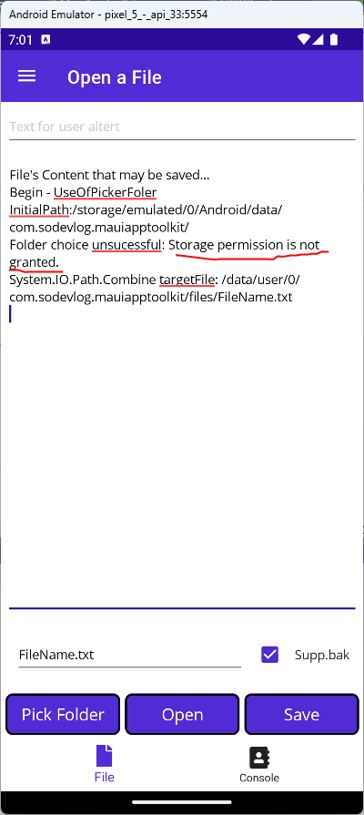

## Notes en ERRORs

### FilePicker

Needed to take really good care with customFileType. 

For example this PickOptions options:

```csharp
FilePickerFileType customFileType = new FilePickerFileType(
        new Dictionary<DevicePlatform, IEnumerable<string>>
        {
            { DevicePlatform.iOS, new[] { "public.my.comic.extension" } }, // UTType values
            { DevicePlatform.Android, new[] { "*/*" } }, // MIME type
            { DevicePlatform.WinUI, new[] { ".txt", ".bak", "*.*" } }, // file extension
            { DevicePlatform.Tizen, new[] { "*/*" } },
            { DevicePlatform.macOS, new[] { "cbr", "cbz" } }, // UTType values
        });

PickOptions options = new()
{
    PickerTitle = "Please select a file",
    FileTypes = customFileType,
};

resultFilePicker = await FilePicker.Default.PickAsync(options);
```

Will drives you directly to:

C:\Users\xxxx\Documents\Visual Studio 2022\Samples\MAUI\MauiAppToolkit\MauiAppToolkit\obj\Debug\net7.0-windows10.0.19041.0\win10-x64\Platforms\Windows\App.g.i.cs

In line:

```csharp
#if DEBUG && !DISABLE_XAML_GENERATED_BREAK_ON_UNHANDLED_EXCEPTION
            UnhandledException += (sender, e) =>
            {
                if (global::System.Diagnostics.Debugger.IsAttached) global::System.Diagnostics.Debugger.Break();
            };
#endif
```

because you said :

```csharp
{ DevicePlatform.WinUI, new[] { ".txt", ".bak", "*.*" } }, // file extension
```

instead of saying :

```csharp
{ DevicePlatform.WinUI, new[] { ".txt", ".bak", "*" } }, // file extension
```

### Storage Permission is not granted!

Error on Android Emulator impossible to read file even directory on branch use-toolkit-maui-folderpicker I use the folder picker to see "where we are" in the directory tree.
But it don't works cause Storage Permission is not granted!



But yet:

[Try FolderPicker on Android Emulator](https://github.com/mabyre/MauiAppToolkit/commit/8add4f14d2215c6593a18ea628d330a288cbe25d)

