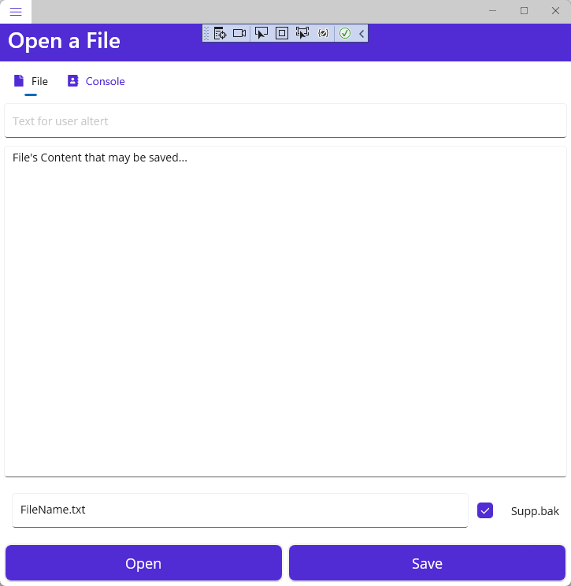

## MauiAppToolkit

Toolkit denomination take place in simple code that can be used to make simple integration.

This project comes from the need of understanding what happend on Android plateform
when you save a file the content is not saved it just disapear in cache memory
what is the way to save a file for exemple in OneDrive...

storage/emulated/0/Android/data/com.compagnyname.appname



### Getting started

This application is a Flyout Tab ContentPage :

```xaml
<FlyoutItem Title="Console" Route="consolepage" FlyoutIcon="{StaticResource IconTwo}">
    <Tab Title="File" Icon="{StaticResource IconOneTab}">
        <ShellContent
            Title="One"
            ContentTemplate="{DataTemplate local:MainPage}"
            Route="mainpage" />
    </Tab>
```

### Log to a Console

For applications that are a little tutchy, it's important while you are not in debug mode to have clear messages to the user. This the aim of Console.

### Storage and Save File

FileSystem.Current.CacheDirectory :
/data/user/0/com.companyname.mauiapptoolkit/cache

FileSystem.Current.AppDataDirectory
/data/user/0/com.companyname.mauiapptoolkit/files

Here is the path to a file ridden from OneDrive: 

/storage/emulated/0/Android/data/com.companyname.mauiapptoolkit/cache
/2203693cc04e0be7f4f024d5f9499e13/92c9d622ed3d489a8a37b988f0c003c1/file.xxx

Has we can see when you read a file from OneDrive, or other clouds, the file is stored in cache directory. 
Therefor it's not usefull to save the file, user will not find it. 
So the application will save the file in "application user's accessible directory".

Have fun!
