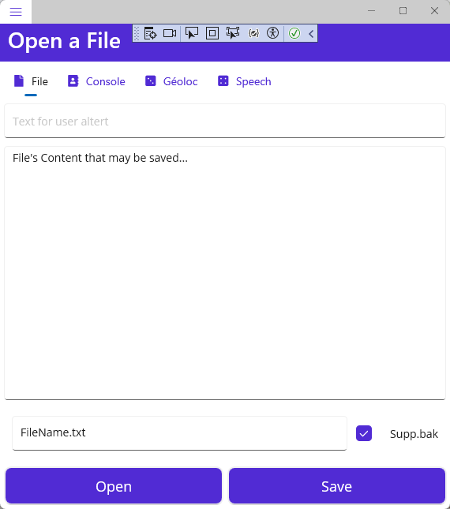

## MauiAppToolkit

Toolkit denomination take place in simple code that can be used to make simple integration.

This project comes from the need of understanding what happend on Android plateform
when you save a file the content is not saved it just disapear in cache memory
what is the way to save a file for exemple in OneDrive...

storage/emulated/0/Android/data/com.compagnyname.appname



### Getting started

This application is a Flyout Tab ContentPage :

```xaml
<FlyoutItem Title="Console" Route="consolepage" FlyoutIcon="{StaticResource IconTwo}">
    <Tab Title="File" Icon="{StaticResource IconOneTab}">
        <ShellContent
            Title="One"
            ContentTemplate="{DataTemplate local:MainPage}"
            Route="mainpage" />
    </Tab>
```

### Log to a Console

For applications that are a little tutchy, it's important while you are not in debug mode to have clear messages to the user. This the aim of Console.

I did several tries until I realized that my Console viewmodel was not updated. 
I had binder on a SetProperty of the Community.Mvvm.Toolkit when I clicked on Navigate to Console 
the Message was not updated.

Then I realize I could have code into the View to do something when you Navigated To the View:

```csharp
NavigatedTo="ContentPage_NavigatedTo"
```

Then all I had to do is to instanciate a new ViewModel with the updated Message:

```csharp
//<event>
private void ContentPage_NavigatedTo(object sender, NavigatedToEventArgs e)
{
    ConsoleViewModel viewModel = new ConsoleViewModel(_viewModel.MessageText);
    BindingContext = viewModel;
}
//</event>
```

Last thing was to add a constructor to ConsoleViewModel that pass the updated Message to the new ConsoleViewModel.

```csharp
public ConsoleViewModel(string msg)
{
    base.MessageText = msg;
}
```


I think now I have a good command of the MvvM model.

### Storage and Save File

This is the tuff subject when you deploy on multiple platforms.

FileSystem.Current.CacheDirectory :
/data/user/0/com.companyname.mauiapptoolkit/cache

FileSystem.Current.AppDataDirectory
/data/user/0/com.companyname.mauiapptoolkit/files

Here is the path to a file ridden from OneDrive: 

/storage/emulated/0/Android/data/com.companyname.mauiapptoolkit/cache
/2203693cc04e0be7f4f024d5f9499e13/92c9d622ed3d489a8a37b988f0c003c1/file.xxx

Has we can see when you read a file from OneDrive, or other clouds, the file is stored in cache directory. 
Therefor it's not usefull to save the file, user will not find it. 
So the application will save the file in "application user's accessible directory".

### Integration of SpeechToText module

If there is, this one is a very intresting game, first discover the module in:

[community-toolkit\samples\CommunityToolkit.Maui.Sample\Pages\Essentials](https://github.com/CommunityToolkit/Maui/tree/main/samples/CommunityToolkit.Maui.Sample/Pages/Essentials)

Then make it works in MauiAppToolkit:


Doing this you will see all the implications.

Have fun!
